### Hi, I'm Anton 

-----

- 📇 BS in Cybersecurity from Northern Arizona University
- ⚔️ I'm currently working as a Penetration Tester for Dark Wolf Solutions & serving as a Cyber Warfare Specialist with the Utah Air National Guard.
- 👥 I'm always looking for new opportunities to collaborate on open source security research or bug bounties, contact me at antonhibl11@gmail.com

